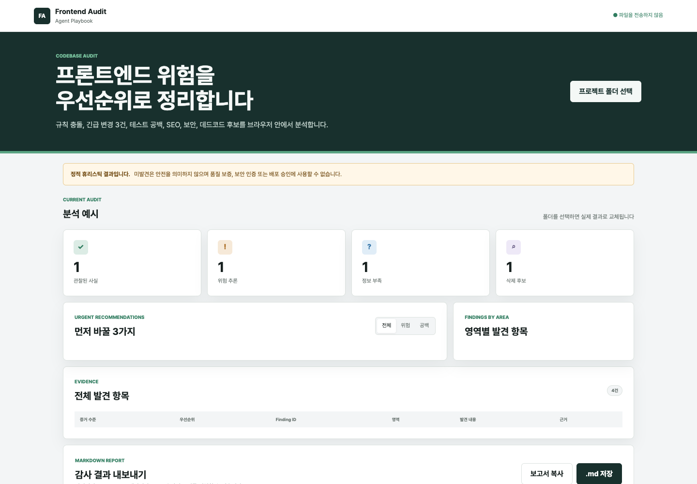

# frontend-agent-playbook

[English](README.md) | [한국어](README.ko.md)

[](https://github.com/h4ckney/frontend-agent-playbook/actions/workflows/validate.yml)
[](LICENSE)

Production-oriented frontend playbook for Claude Code, Codex, and other AI coding agents.

This repository defines practical rules, skills, examples, and templates for React, Next.js, TypeScript, forms, runtime validation, state ownership, design systems, styling, internationalization, bundle and dependency decisions, security, privacy, data fetching, caching, error handling, observability, accessibility, SEO, performance, testing, dead-code removal, and code review workflows.



## Why Not Just Another Rules List?

- **Audit before adoption**: inspect the codebase, versions, router, rendering model, existing instructions, and evidence before selecting guidance.
- **Approval-gated changes**: proposals, file-level approval, application, and external Issue publication remain separate boundaries.
- **Version-aware frontend decisions**: distinguish Pages Router from App Router, RSC from non-RSC React, and compiler-supported TypeScript features.

## Quick Start

Vendor the tagged playbook without activating every rule:

```bash
npx degit h4ckney/frontend-agent-playbook#v0.1.1 .agents/vendor/frontend-agent-playbook
```

`v0.1.1` is the current stable snapshot and points to commit `0970f8c`. Post-release work starting with commit `697d53f` is available only on `main` and is not part of `v0.1.1`. Evaluate unreleased work from `main` only when the target repository accepts it, and pin the reviewed commit before production adoption.

Add the smallest entry point to the target repository's `AGENTS.md`:

```markdown
## Frontend Agent Guidance

- Start with `.agents/vendor/frontend-agent-playbook/rules/governance.md`.
- Use `.agents/vendor/frontend-agent-playbook/skills/audit-frontend-rules/references/rule-routing.md` to select only task-relevant rules.
- Reinspect the installed framework, router, rendering model, TypeScript version, lint, tests, and local instructions before applying guidance.
- Keep project instructions and version-matched official documentation above the vendored playbook.
- Do not create project rules, skills, enforcement, or external Issues before explicit scoped approval.
```

This copies the playbook as reference material. It does not make every vendored rule active and does not replace project-specific instructions.

### Marketplace Preview

The repository now contains an unreleased marketplace preview for local testing. The Codex manifest uses `0.1.2-dev.0`; the Claude Code manifest intentionally omits a fixed version so Git-based preview updates follow commits. The package includes the routed audit and approved-application skills with their rules, templates, scripts, and migration playbooks. Installing the plugin does not make every rule active.

Claude Code:

```text
/plugin marketplace add h4ckney/frontend-agent-playbook
/plugin install frontend-agent-playbook@frontend-agent-playbook
/reload-plugins
```

Codex:

```bash
codex plugin marketplace add h4ckney/frontend-agent-playbook --ref main
codex plugin add frontend-agent-playbook@frontend-agent-playbook
```

The Codex local marketplace add and install path has been smoke-tested in an isolated configuration directory. Claude Code packaging is structured from its documented marketplace schema but has not been installed on this machine because the Claude Code CLI is unavailable. Use `main` only for local preview, then install from a reviewed release tag once one includes the package. Do not present this preview as a public marketplace release.

## What This Is

`frontend-agent-playbook` is a frontend operating playbook for AI coding agents working on production applications.

It is designed to reduce vague AI-generated code and push agents toward senior frontend engineer behavior: reading existing code first, following project conventions, handling real UI states, preserving accessibility, and verifying changes before completion.

## How To Use

Reference the relevant playbook files from project instructions, agent memory, `AGENTS.md`, Claude Code instructions, or a Codex task prompt. Do not inject every rule by default.

Always start with [Rule governance](rules/governance.md), then use [Rule routing](skills/audit-frontend-rules/references/rule-routing.md) to select the smallest task-specific subset.

Available rules:

- [React rules](rules/react.md)
- [Next.js rules](rules/nextjs.md)
- [TypeScript rules](rules/typescript.md)
- [Forms and runtime validation rules](rules/forms-runtime-validation.md)
- [State ownership rules](rules/state-ownership.md)
- [Design system and styling rules](rules/design-system-styling.md)
- [Internationalization rules](rules/i18n.md)
- [Bundle and dependency rules](rules/bundle-dependencies.md)
- [Security and privacy rules](rules/security-privacy.md)
- [Data fetching and cache rules](rules/data-fetching-cache.md)
- [Error handling and observability rules](rules/error-handling-observability.md)
- [Performance rules](rules/performance.md)
- [Accessibility rules](rules/accessibility.md)
- [SEO rules](rules/seo.md)
- [Testing rules](rules/testing.md)
- [Dead-code removal rules](rules/dead-code.md)
- [Code review rules](rules/code-review.md)
- [Enforcement mapping](docs/enforcement-mapping.md)
- [Analyzer v0.2 design](docs/analyzer-v0.2-design.md)
- [Pages Router to App Router migration playbook](playbooks/pages-to-app-router.md)
- [React 18 to React 19 migration playbook](playbooks/react-18-to-19.md)

Then use the examples and templates:

- [Claude example](examples/claude.md)
- [Codex example](examples/codex.md)
- [Version-aware review examples](examples/version-aware-review.md)
- [Pages Router production audit](examples/audits/pages-router-production.md)
- [App Router representative audit](examples/audits/app-router-representative.md)
- [Guidance adoption forward-test](examples/adoption/forward-test.md)
- [Production application workflow](examples/production-application/feature-workflow.md)
- [Feature implementation template](templates/feature-implementation.md)
- [Refactor request template](templates/refactor-request.md)
- [Bug fix template](templates/bug-fix.md)
- [Frontend rules decisions template](templates/frontend-rules-decisions.md)
- [Guidance proposal template](templates/guidance-proposal.md)
- [Audit issue draft template](templates/audit-issue.md)

For an existing codebase, use the [Audit Frontend Rules skill](skills/audit-frontend-rules/SKILL.md) to identify conflicts, exceptions, state-ownership risks, design-system drift, internationalization gaps, bundle and dependency risks, security and privacy risks, data and cache risks, error-handling gaps, removal candidates, and testing gaps before adopting the full rule set.

After an owner approves named proposal IDs, use [Apply Frontend Guidance](skills/apply-frontend-guidance/SKILL.md) to create only the approved project rules or skills, validate them, and persist the applied decision. Project guidance remains unapplied and issue drafts remain unpublished until separately approved.
The dependency-free [guidance approval gate](scripts/guidance-approval.mjs) compares supplied approval metadata for repository identity, proposal status, material scope, exact target paths, dependencies, enforcement, content fingerprints, conflicts, and idempotent reruns before application. It does not inspect repository ownership or compute target-file fingerprints; the applying agent must gather and verify those inputs.
Dashboard Markdown exports include stable finding IDs and an Audit Handoff table. Carry those IDs into proposals and Issue drafts for traceability, but do not treat them as defect proof or write approval.

For a quick local scan, open the [Frontend Audit dashboard](analysis/index.html), choose the project's search-exposure scope, and select a project folder. It separates observed facts, risk inferences, information gaps, and removal candidates, applies SEO checks only to relevant public scope, groups findings with the same root cause into risk clusters, explains possible impact and the next verification, then exports the result as Markdown. Files remain in the browser, sensitive values are excluded from reports, and automated findings still require manual verification.

## Repository Structure

- `rules/`: Core frontend rules by topic
- `skills/`: Repeatable agent workflows for applying and maintaining rules
- `examples/`: Copy-ready agent instruction examples
- `templates/`: Fillable request forms for common frontend work
- `docs/`: Planning and project documentation
- `scripts/`: Dependency-free repository validation commands
- `analysis/`: Dependency-free local audit dashboard and Markdown report generator
- `playbooks/`: Separately approved framework and runtime migration procedures
- `plugins/`: Synchronized installable package used by the Claude Code and Codex marketplace catalogs

## Source Priorities

The complete policy lives in [Rule Governance](rules/governance.md). In summary, use this order:

1. Non-negotiable security, accessibility, privacy, and data-integrity requirements
2. Explicit user requirements and intended product behavior
3. Existing codebase configuration and established patterns
4. Official documentation for the framework and version in use
5. Rules in this repository
6. Team preferences not already encoded in the project

Existing patterns do not justify preserving known correctness, security, or accessibility defects.

## Maturity Status

| Area | Status | Notes |
| --- | --- | --- |
| Governance | Usable draft | Precedence, applicability, explicit requirement levels, exceptions, and removal policy added |
| React | Usable draft | Official references and agent checklist added |
| Next.js | Usable draft | Official references and agent checklist added |
| TypeScript | Usable draft | Official TypeScript references added |
| Forms / Runtime Validation | Usable draft | Trust boundaries, schema ownership, server authority, accessible errors, and risk-based testing added |
| State Ownership | Usable draft | Server, URL, draft, local, shared, optimistic, persisted, and hydrated state boundaries added |
| Design System / Styling | Usable draft | Existing-system reuse, tokens, variants, responsive behavior, themes, and escape-hatch guidance added |
| Internationalization | Usable draft | Locale ownership, messages, formatting, direction, layout expansion, hydration, and localized SEO guidance added |
| Bundle / Dependencies | Usable draft | Runtime boundaries, dependency decisions, code splitting, measured budgets, and loading-failure guidance added |
| Security / Privacy | Usable draft | Sensitive storage, third-party script, CSP, and auth-boundary guidance added |
| Data Fetching / Cache | Usable draft | Server-client boundary, freshness, invalidation, and mutation guidance added |
| Error Handling / Observability | Usable draft | Failure modeling, recovery, telemetry, and instrumentation guidance added |
| Performance | Usable draft | web.dev, MDN, and Next.js references added |
| Accessibility | Usable draft | WCAG 2.2 and WAI-ARIA APG guidance added |
| SEO | Usable draft | Public/internal applicability gate, indexing intent, canonical, robots, sitemap, structured data, and URL lifecycle guidance added |
| Testing | Usable draft | Risk-based unit, component, integration, and E2E guidance added |
| Dead Code | Usable draft | Evidence-based code, dependency, asset, style, and flag removal guidance added |
| Code Review | Usable draft | Critical / Standards / Optimization gates added |
| Audit Skill | Representative-tested draft | Evidence-based audits plus scoped rule, skill, and issue proposals are documented |
| Guidance Application | Metadata-gated and representative-tested draft | Approval drift, rejection, conflict, fingerprint, and idempotent rerun tests added; repository inspection remains agent-owned |
| Rule Routing | Usable draft | Governance-first task and risk routing added |
| Enforcement Mapping | Usable draft | Compiler, lint, CI, and manual-review boundaries documented |
| Audit Dashboard | Usable draft | Input budgets, partial-analysis disclosure, risk clusters, impact narratives, stable IDs, browser smoke test, and Markdown export added |
| Marketplace Package | Codex-local-tested preview | Claude Code and Codex catalogs added; Claude Code install remains unverified on this machine |
| Migration Playbooks | Usable draft | Incremental Pages-to-App and React 18-to-19 gates, verification, rollback, SEO, RSC, and Compiler boundaries added; live migration validation remains pending |
| Examples | Usable draft | Agent prompts, audits, guidance adoption forward-test, and production application workflow added |
| Templates | Usable draft | Request, decision, guidance proposal, and issue draft formats added |

## Roadmap

- Forward-test the [implemented issue drafts](docs/next-issue-drafts.md) against an additional live repository before enabling external Issue publication.
- Add more realistic good and bad examples.
- Add framework-specific examples for common Next.js workflows.
- Add review examples with severity labels.
- Forward-test the audit skill against an additional live App Router or mixed-router repository.
- Forward-test rule routing against implementation, review, SEO, and dead-code tasks.
- Install-test the marketplace package with Claude Code.
- Forward-test both migration playbooks against representative repositories before calling them production-validated.
- Decide whether to release the adversarially reviewed dashboard, plugin, and migration work as `v0.1.2`; the current `main` branch is not `v0.1.2`.

## Validation

Run the dependency-free validation commands before committing changes:

```bash
node scripts/validate-docs.mjs
node scripts/sync-plugin-package.mjs --check
node --check analysis/app.js
node --check analysis/analyzer.js
node --test analysis/analyzer.test.mjs analysis/browser-smoke.test.mjs scripts/guidance-approval.test.mjs
```

The documentation script checks local Markdown links, unresolved TODO markers, required rule and workflow sections, skill frontmatter, and skill UI metadata references. The package sync check prevents installable plugin copies from drifting from their canonical sources. GitHub Actions runs the same documentation, package, analyzer, browser-smoke, and approval-gate checks for pull requests and pushes to `main`.

## Version

Current stable release: [`v0.1.1`](https://github.com/h4ckney/frontend-agent-playbook/releases/tag/v0.1.1), pointing to commit `0970f8c`.

The `main` branch includes post-release work starting with audit-result UI commit `697d53f`, followed by input-budget, risk-cluster, plugin-packaging, and migration-playbook changes. The combined work has local validation but remains unreleased pending the `v0.1.2` release decision and tag.

## License

This repository is available under the [MIT License](LICENSE).
